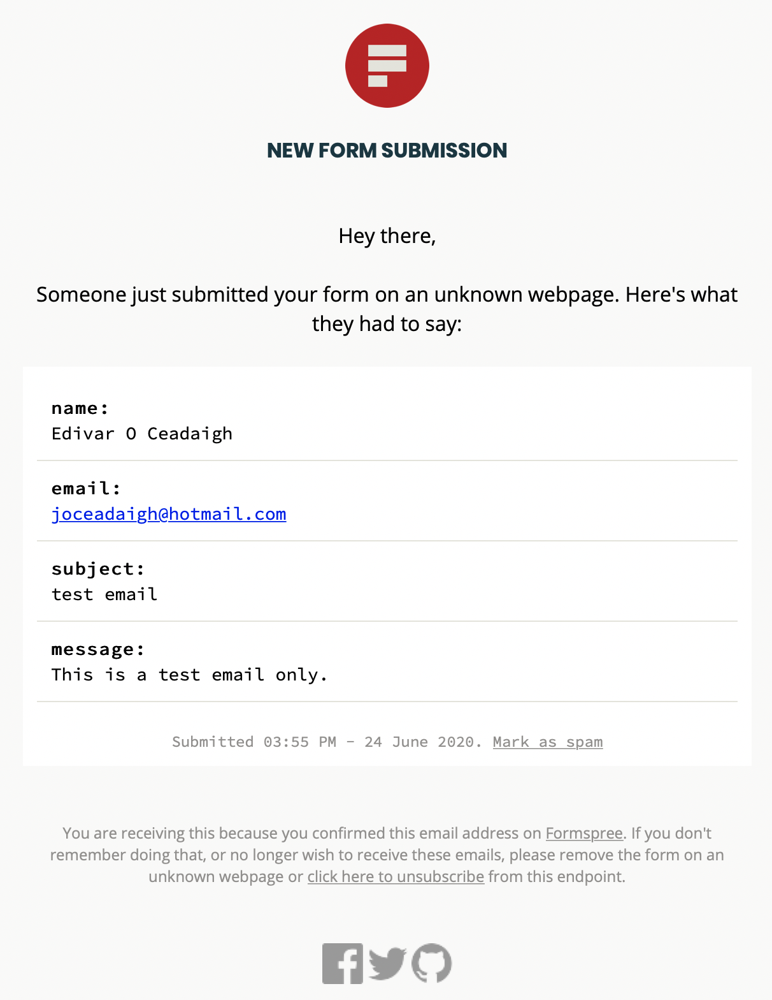
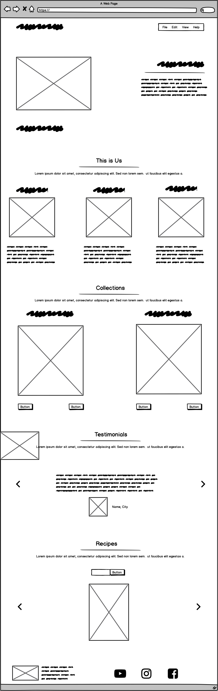
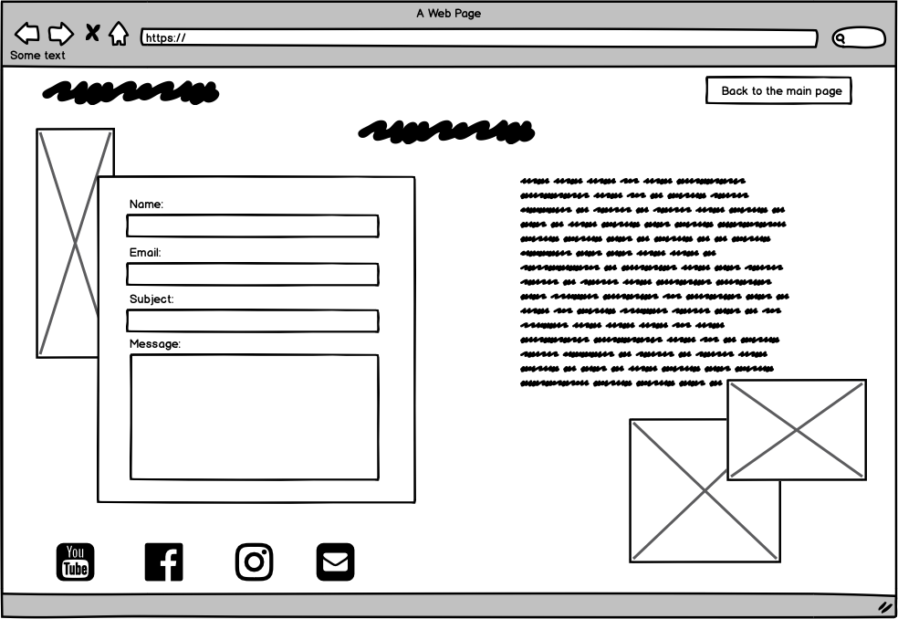

# BakedToATea
This project was designed to provide a better understanding of a small baking company made by family members that evolved into a great business. The website is focused on purely weddings and brunch.
It is also responsive, therefore it can be accesseded on different device's type, such as computer, tables and phones.

## Strategy:
>
By showing the company's origin and the way how they do business, the website exposes it in order to attract clients. 

## User Experience (UX)
>
### User Stories:
- First Time Visitor Goals
    - As a First Time Visitor, I want to see the design of the website, as I believe that a poor website doesnt show credibility.
    - As a First Time Visitor, I want to check the work done by the company and see if it align with my expectations.
    - As a First Time Visitor, I want it to be simple to use and practical.
- Returning Visitor Goals
    - As a Returning Visitor, I want to find new testimonials and, specially, new images of cakes and sweets.
    - As a Returning Visitor, I want to find a direct communication channel with the company.
- Frequent User Goals
    - As a Frequent Visitor, I want to find new recipes.

### Scope:
>
the website is provided with an initial page which has a nav bar who can take the user anywhere in the site.
It mention a bit of the company history, where the user get to know about the company and their beliefs. 
The page also shows a collection of products created for its clients and a page with its client's comments about the company.
Not less important, the site provides a last page who offer the users the option of getting recipes online.

### Design:
>
Home: It reflects the company's main purpose. The gold background in conjunction with the cake image translates the company main focus.

about: contains part of the company's history and also has the function of express the company values and purpose.

Collection: this section aim to gather the user attention by showing some of the company's selection.

Testominials: the focus here is making its potencial clients feel more confortable with the company's work by reading other clients comments.

Recipes: The main goal here is, besides of providing an varieties of recipes, is to offer the option of having any of the recipes that they find on the website prepared for them.

Footer: the company's map can be accessed, as its facebook, youtube, instagram and contact.

Contact page: The user can send all their queries. This page is fully operative. Once the user send it, the querie goes to a website who host the message and also sends an email to the registered receiver, as per image below.

- Color Scheme

The two colors used were gray and gold.

- Typography

The 'News Cycle' font is the only font used in this website and having sans-serif as its fallback font in case of any browser incompatibility;

- Imagery
The intro image reflects the clean, the modern and in combination with the gold color, express atention to details and sofistication.

## User Interface (UI)
>

## Features

- Responsive on all device sizes

- Interactive elements

## Technologies Used

### Languages Used:
>
- HTML  
- CSS  
- Bootstrap
- Javascript
- Jquery

### Frameworks, Libraries & Programs Used

- Bootstrap 4.5.0:

Bootstrap was used to assist with the responsiveness and styling of the website, specially when adjusting the screen size in order to improve the responsiveness.
- Hover.css:

Hover.css was used on the Social Media icons in the footer to add the float transition while being hovered over.
- Google Fonts:

Google fonts were used to import the 'News Cycle' font into the style.css file which is used on all pages throughout the project.
- Javascipt:

Javascript is used to get information from the recipe API and google map API and display it in the website.
- jQuery:

jQuery is used to make the carousel and contact pages.
- Git:

Git was used for version control by utilizing the Gitpod terminal to commit to Git and Push to GitHub.
- GitHub:

GitHub is used to store the projects code after being pushed from Git.
- Google API:

Google API is used to add to the project the company's location.
- Recipe API:

Recipe API from "https://api.edamam.com" is used in this project in order to offer the users free recipes (Which can also be prepared by the company as per client's wish).
- Balsamiq:

Balsamiq was used to create the wireframes during the design process.

## Testing:
>
The testing was done in different screen sizes, including the mobile screen through the python server and using github repository link.

The website link was sent out to a couple of people for testing purpose only. The topics to be analysed were design, functionability(mobile and computer version), user response. As a result of it, there were found the below:

1. issue: the map doesnt expand on some mobiles type.

    Not resolved.
2. Issue: The testominial screen height wasnt enough for screen size bigger then 1400px.

    Resolved. Added a @media to scale the page.
3. Issue: The logo name wasnt showing completely when displayed in mobile small screen. For example iPhone 8 or smaller.

    Resolved. Rescaled the page.
4. Contact was missing.

    Resolved. Created a contact page.
5. When trying to click on the Navbar when in the Testimonial page, the right arrow from the carousel was occupying all side screen. 

    Resolved. In CSS, added z-index on the class related to the arrow in order to position it behind the navbar.

The project was also tested on Safari, Internet Explorer and Chrome web browsers and it behaved as expected.

The website was viewed on desktop, laptop 16', laptop 13', iPhone 11, iPhone 11 Max, Iphone 7, Samsumg Galaxy 10.

### Khown Bugs
The map didnt open on iPhone 11 Max.
## Deployment:
>
The website is hosted using GitHub, deployed from the master branch. The deployed site was updated automatically upon new commits and in order for the site to send the information correctly to GitHub, the main page was called index.html.

## Content:
>
Some of the content of this webpage was taken from the below:
1. https://www.covecakedesign.ie/about/
2. https://cgweddingcakedesign.ie/
3. http://amazingcakes.ie/

## Media:
>
Some of the images of this project were taken from the links below:
https://www.covecakedesign.ie/
All the images from the collections page/ brunchs were taken from a friend who creates wedding cakes and cokies.

## Credits

### Acknowledgements:
>
Got a great suppport from my mentor, who had the patience and great hability of teaching me API in a clear and easier way.

